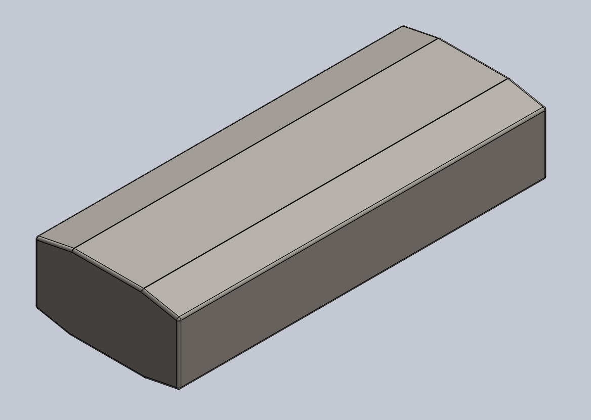
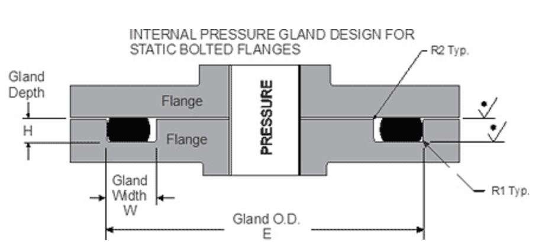
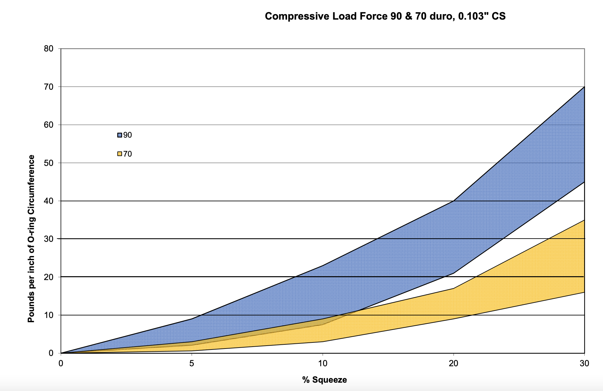
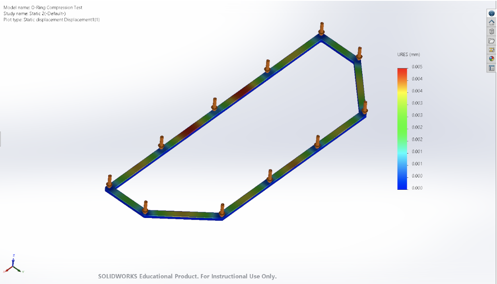

# Plastic 3D Printed Fuel Tank with Custom O-Ring

For the 3D printed plastic fuel tank, there were a few design requirements that needed to be kept in mind. 
* The tank needed to have around 5 Liters of capacity.
* A taller fuel tank is sometimes better because it reduces the amount of sloshing in the tank. However, a shorter/flatter fuel tank makes it so that the fuel tank has a lower center of gravity. (You want to try and keep most components on a race car as low as possible because that keeps the car's center of gravity low and the tires get better grip on the road.) 
* The tank needed to attach via at least three easy to access tabs to the frame of the car.
* Try to keep the weight of the fuel tank as low as possible without risking structural integrity
* It's best to keep the fuel tank as far away as possible from the exhaust because using colder fuel runs the engine more efficiently. [(1)](https://www.racecar-engineering.com/articles/f1/technology-explained-f1-fuel-systems/)
* The fuel tank must have room for the Holley Hydramat at the bottom. 

With all of that in mind, below are a few screenshots of the fuel tank design in SolidWorks. The overall shape is pretty simple, with a flat 3" by 15" base for the Holley Hydramat. 

  

The Holley Hydramat basically acts as a sponge that absorbs fuel in the tank and thus ensures a constant pump/flow rate of fuel even while some of the fuel might be sloshing in the tank. 

Sadly, I do not have the files for the final results of 3D printed fuel tank, I believe someone might have overwritten them by accident on the team's file sharing program. 

Properties of fuel tank:

One of the main components of this fuel tank was that it incorporated the use of a custom O-Ring to ensure that no fuel could leak out. For the O-Ring, I decided to use the material [Viton](https://www.aceseal.com/o-ring-materials#:~:text=discuss%20customization%20options.-,Buna%2DNitrile,tanks%2C%20automotive%20and%20aerospace%20applications) which has good resistance to corrosion as well as high temperatures. I determined that a good cross-section for the O-Ring was 7/64" and used this [specification sheet](https://www.marcorubber.com/o-ring-groove-design-face-seal.htm) to determine certain values like the gland width and gland depth necessary for the O-Ring.

  

| O-Ring Cross Section | Gland Width | Gland Depth | R1 | R2 |
| --- | --- | --- | --- | --- |
| .103" | .124" | .081" | .010" | 0.005" |

I then determined by what percentage I needed to squeeze the O-Ring by using [this tutorital](https://www.ehow.com/how_7602556_calculate-oring-squeeze.html) and found that value to be 27% squeeze. Then, using [this chart](https://www.parker.com/content/dam/Parker-com/Literature/O-Ring-Division-Literature/O-Ring-ehandbook-pdfs/compression-load-force-by-cross-section-70-and-90-duro.pdf), I determined that an O-Ring with .103" cross section and ~70 durometer needs around 30lbs/in of applied force in order to create a tight seal.

  

Because O-Rings only really come in certain sizes/lengths and the O-Ring for the fuel tank would have to be more rectangular than circle-shaped, I decided that we would instead use a custom O-Ring. We would purchase the custom O-Ring cord then cut it to length and glue the two ends together. [This video/tutorial](https://bit-tech.net/guides/modding/watercooling/how-to-make-custom-length-o-rings-for-distro-plates/1/) does a pretty good job of explaining how this process works.

I then tried to emulate an FEA simulation outlined in [this article](https://tarkka.co/2019/04/11/overview-of-hyperelastic-fea-of-o-ring/) to determine if there was enough compression force at the fastener points to ensure that all points of the O-Ring along the groove were being compressed. Below is a screenshot of the results for my run of the FEA simulation (the maximum displacement is about 0.005 mm which is negligible in this scenario.)

  

### References
1. https://www.racecar-engineering.com/articles/f1/technology-explained-f1-fuel-systems/
2. [O-Ring Material Selections](https://www.aceseal.com/o-ring-materials#:~:text=discuss%20customization%20options.-,Buna%2DNitrile,tanks%2C%20automotive%20and%20aerospace%20applications)
3. https://www.marcorubber.com/o-ring-groove-design-face-seal.htm
4. https://www.ehow.com/how_7602556_calculate-oring-squeeze.html
5. [Parker Hannifin O-Ring Compressive Load Charts](https://www.parker.com/content/dam/Parker-com/Literature/O-Ring-Division-Literature/O-Ring-ehandbook-pdfs/compression-load-force-by-cross-section-70-and-90-duro.pdf)
6. https://bit-tech.net/guides/modding/watercooling/how-to-make-custom-length-o-rings-for-distro-plates/1/
7. https://tarkka.co/2019/04/11/overview-of-hyperelastic-fea-of-o-ring/
